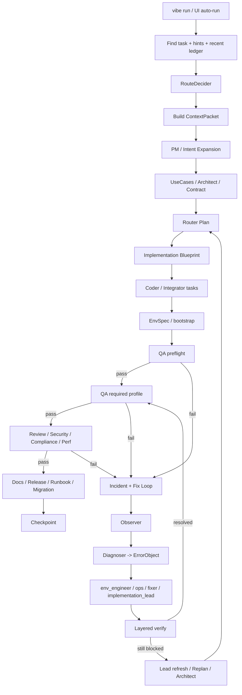

# Vibe 系统地图（维护版）

> 这份文档不是产品宣传文档，而是**维护地图**。目标是让我们在改系统时，先找到入口，再动代码。
>
> 当前状态补充：
>
> - 系统已经具备 `Route -> Blueprint -> Fix-loop -> Incident -> Resume/Replan` 的完整骨架
> - 真正的维护难点已从“缺功能”转成“诊断是否命中根因、scope 是否放对、agent 是否路由到正确层”
> - `orchestrator.py` 仍然过大，拆分工作**已经开始**，但还没有完全完成

## 1. 先看结论

当前仓库已经不是“小 CLI 工具”，而是一个由以下几层组成的系统：

1. **CLI / Chat 入口层**
2. **编排器 / 状态机层**
3. **Agent / Prompt / 路由层**
4. **工具层（文件 / 命令 / git / 搜索）**
5. **存储层（ledger / artifacts / checkpoints / refstore）**
6. **知识与经验层（memory / lessons / knowledge base）**
7. **VS Code 扩展层**

真正复杂的地方不在“文件数量”，而在于：

- 一项行为往往同时穿过 `config -> orchestrator -> schemas -> tests -> vscode`
- 大量逻辑已经不是“单点 if/else”，而是**事件驱动 + prompt 驱动 + 工具执行**的组合
- fix-loop、resume、route、ownership、env remediation 之间已经互相影响

因此，维护策略必须是：

- **先定位层，再定位函数，再定位 prompt**
- **不要从 UI 现象直接改某一行文案**
- **优先补规则/路由/事件，而不是只补一个临时 patch**

---

## 2. 仓库结构总览

```text
HongyouCoding/
├─ vibe/                    # 核心 Python 包
│  ├─ cli.py                # CLI + chat + vision 入口
│  ├─ orchestrator.py       # 主编排器（当前仍然最核心、最复杂）
│  ├─ orchestration/        # 新拆分出的编排辅助模块（拆分进行中）
│  │  ├─ shared.py          # scope / replan 常量与通用函数
│  │  └─ contracts.py       # Python contract audit / 静态一致性检查
│  ├─ config.py             # agent/provider/route/governance 默认配置
│  ├─ routes.py             # RouteDecider / 风险信号 / 路由决策
│  ├─ policy.py             # 工具权限控制
│  ├─ ownership.py          # 文件归属 / 审批
│  ├─ toolbox.py            # 工具聚合
│  ├─ context.py            # chat 压缩 / digest / memory
│  ├─ manifests.py          # 项目扫描与系统说明 manifest
│  ├─ scan.py               # 仓库扫描
│  ├─ delivery.py           # 需求/计划增强
│  ├─ branching.py          # branch/worktree 派生
│  ├─ repo.py               # repo root / .vibe 初始化
│  ├─ secrets.py            # 工作区密钥存储
│  ├─ knowledge/            # 经验知识库
│  ├─ providers/            # DeepSeek / DashScope / Mock / JSON repair
│  ├─ storage/              # ledger / artifacts / checkpoints / refstore
│  ├─ schemas/              # packs / events / memory
│  ├─ tools/                # fs / cmd / git / search
│  └─ agents/               # agent registry / base
├─ tests/                   # 回归测试
├─ vscode-vibe/             # VS Code 扩展
├─ .vibe/                   # 当前仓库自身的工作区状态
└─ README.md
```

---

## 3. 维护时先看哪些文件

### 3.1 改“系统行为”

先看：

- `vibe/orchestrator.py`
- `vibe/orchestration/shared.py`
- `vibe/orchestration/contracts.py`
- `vibe/config.py`
- `vibe/routes.py`
- `vibe/schemas/packs.py`

### 3.2 改“聊天/侧边栏行为”

先看：

- `vibe/cli.py`
- `vibe/context.py`
- `vscode-vibe/src/vibeDashboard.ts`
- `vscode-vibe/src/vibeRunner.ts`

### 3.3 改“为什么它会跑错 / 修不动”

先看：

- `vibe/orchestrator.py`
- `vibe/orchestration/contracts.py`
- `vibe/knowledge/solutions.yaml`
- `tests/test_fix_*`
- `tests/test_incident_capsule.py`
- `tests/test_python_env_and_scope.py`

### 3.4 改“Agent、路线、权限”

先看：

- `vibe/config.py`
- `vibe/routes.py`
- `vibe/policy.py`
- `vibe/ownership.py`

---

## 4. 运行时主链路

### 4.1 CLI 链路

入口：

- `vibe/cli.py:101` `init`
- `vibe/cli.py:208` `task_add`
- `vibe/cli.py:722` `chat`
- `vibe/cli.py:992` `run`
- `vibe/cli.py:1139` `checkpoint_list`
- `vibe/cli.py:1229` `branch_create`

### 4.2 `vibe run` 的主控制器

核心入口：

- `vibe/orchestrator.py:4860` `run()`

这是整个系统的总状态机。它负责：

- 读任务
- 读 ledger / recent events / user hints
- 选 route
- 激活 agent
- 生成需求 / 用例 / 架构 / 契约 / 计划
- 实现代码
- 运行 QA
- 进入 fix-loop
- 触发 review / security / compliance / perf / docs / release
- 产 checkpoint
- 必要时 resume / replan

### 4.3 当前最重要的“诊断真相”

从最近几轮真实项目失败（例如 `D:\R\testproject`）可以确认，系统现在的主要瓶颈不是“不会修补丁”，而是：

- 会把**契约/接口/数据结构错误**误判成环境问题
- 会在 fix-loop 里浪费轮次，直到 lead / architect 介入
- 对 `scope mismatch`、`contract drift`、`engine interface mismatch` 的升级还不够早

因此，后续维护的重点不是继续堆更多角色，而是：

- 让 `Observer -> Diagnoser -> ErrorObject -> Fixer` 更稳定
- 让 `contract audit` 比 `env remediation` 更早命中
- 让 `implementation_lead` 控制“该紧的时候紧，该松的时候松”的修复范围

### 4.4 主链路的阶段

对应函数和关键位置：

- **任务与上下文**
  - `vibe/orchestrator.py:403` `_find_task`
  - `vibe/orchestrator.py:419` `_collect_user_hints`
  - `vibe/orchestrator.py:475` `_build_context_packet`
  - `vibe/orchestration/contracts.py` 里的静态 contract audit 辅助函数会在测试故障观察阶段被调用（拆分进行中）

- **路由与 agent 激活**
  - `vibe/routes.py:154` `decide_route`
  - `vibe/orchestrator.py:739` `_agent_pool_for_route`
  - `vibe/orchestrator.py:771` `_required_agents_for_route`
  - `vibe/orchestrator.py:4978` `activate_agent(...)`（在 `run()` 内）

- **需求 / 意图展开 / 用例 / 架构 / 契约 / 计划**
  - `vibe/orchestrator.py:5232` PM
  - `vibe/orchestrator.py:5287` Intent Expander
  - `vibe/orchestrator.py:5355` Requirements Analyst
  - `vibe/orchestrator.py:5386` Architect
  - `vibe/orchestrator.py:5475` Web Info
  - `vibe/orchestrator.py:5513` API Confirm
  - `vibe/orchestrator.py:5566` Router Plan

- **实现**
  - `vibe/orchestrator.py:5611` 主 coder 激活
  - `vibe/orchestrator.py:6326` 计划任务的 CodeChange prompt
  - `vibe/orchestrator.py:4178` `_materialize_code_change`
  - `vibe/orchestrator.py:4358` `_materialize_code_change_with_repair`

- **环境 / QA / fix-loop**
  - `vibe/orchestrator.py:6577` EnvSpec
  - `vibe/orchestrator.py:4583` `_determine_test_commands`
  - `vibe/orchestrator.py:4672` `_run_tests`
  - `vibe/orchestrator.py:7186+` fix-loop 主体

- **契约诊断 / 静态检查（进行中）**
  - `vibe/orchestration/contracts.py`
  - 负责 Python 包结构、导出、异常体系、调用签名、数据形状的静态一致性检查
  - 目标是把“看报错打补丁”升级成“先统一契约、再修根因”

- **高等级 gate**
  - `vibe/orchestrator.py:6932` Code Review
  - `vibe/orchestrator.py:6991` Security
  - `vibe/orchestrator.py:7080` Compliance
  - `vibe/orchestrator.py:7120` Performance
  - `vibe/orchestrator.py:8425` Docs
  - `vibe/orchestrator.py:8465` Release
  - `vibe/orchestrator.py:8508` DevOps
  - `vibe/orchestrator.py:8540` Runbook
  - `vibe/orchestrator.py:8574` Migration

---

## 5. 主状态机（Mermaid）



---

## 6. `.vibe/` 持久化地图

### 6.1 必看目录

- `.vibe/ledger.jsonl`
  - 主事件账本
  - 真相来源之一

- `.vibe/checkpoints.json`
  - checkpoint 元数据
  - 恢复 / resume / replan 入口
  - 行为配置：
    - `behavior.auto_replan_continue`：当出现 `replan_required` 时自动创建 checkpoint 并在同一轮 `vibe run` 里继续（避免让用户手动 rerun）
    - `behavior.max_replans_per_run`：单次 `vibe run` 内最多自动 replan 次数（硬上限）

- `.vibe/artifacts/sha256/...`
  - 所有真实命令输出、patch、incident、fixplan、vision、chat archive
  - 事实比 PM 的自然语言更可信

- `.vibe/views/<agent_id>/`
  - agent 的 memory、bookmarks、rollbacks

- `.vibe/manifests/`
  - `project_manifest.md`
  - `run_manifest.md`
  - `vibe_system.md`
  - `workspace_contract.json`

- `.vibe/refstore.sqlite`
  - Reference Store

### 6.2 真相优先级

维护时建议按这个顺序判断：

1. **artifact 命令输出**
2. **repo 实际文件内容**
3. **ledger 事件**
4. **checkpoint 元数据**
5. **PM/Chat 的自然语言总结**

也就是说：**PM 会幻觉，artifact 不会。**

---

## 6.5 当前已知系统性误判

这几类现象，优先怀疑**诊断或路由层**，而不是直接怀疑模型：

- `pip install` / `npm install` 反复执行但测试错误不变  
  → 多半是 `env_engineer` 被错误激活，真实问题在 contract / import / interface
- `WriteScopeDeniedError` 重复出现  
  → 多半是 repair arena / lead scope 放错，而不是 coder 不会修
- 同一失败每轮都换一个小补丁  
  → 多半还没有把多个失败归并成一个主根因
- architect 被频繁叫起  
  → 先确认是不是 scope/env 问题被误升级成架构问题

---

## 7. 核心存储对象

### 7.1 Ledger

代码：

- `vibe/storage/ledger.py:10`
- `vibe/schemas/events.py:10`

作用：

- 记录所有状态迁移与事实摘要
- UI 进度条、resume、诊断、最近事件回放都依赖它

典型事件：

- `REQ_CREATED`
- `ROUTE_SELECTED`
- `AGENTS_ACTIVATED`
- `CONTEXT_PACKET_BUILT`
- `PLAN_CREATED`
- `PATCH_WRITTEN`
- `TEST_RUN`
- `TEST_FAILED`
- `INCIDENT_CREATED`
- `LEAD_BLUEPRINT_BUILT`
- `CHECKPOINT_CREATED`

### 7.2 Artifacts

代码：

- `vibe/storage/artifacts.py:21`

作用：

- 保存 stdout/stderr/json 报告/patch/vision/chat archive
- 内容寻址，避免重复

### 7.3 Checkpoints

代码：

- `vibe/storage/checkpoints.py:15`
- `vibe/storage/checkpoints.py:37`

作用：

- 记录阶段性状态
- `resume` / `restore` / `replan_required` 都靠它

### 7.4 RefStore

代码：

- `vibe/storage/refstore.py:25`

作用：

- 存外部参考资料
- 目前主要作为轻量参考库，非主流程核心依赖

---

## 8. Agent 地图

### 8.1 默认启用与默认关闭

默认配置都在 `vibe/config.py:175` 之后。

#### 默认长期关键 agent

- `router`
- `implementation_lead`
- `pm`
- `intent_expander`
- `coder_backend`
- `qa`

说明：

- `implementation_lead` 现在的职责已经不是“给建议”，而是**生成蓝图、指定 work order、控制修复范围**
- `env_engineer` / `ops_engineer` 仍由 `router` 执行调度，但应逐步接受 `implementation_lead` 的战术指挥
- `architect` 应只处理设计级 blocker，不应吞掉环境或 scope 问题

#### 按路线/按需启用

- `requirements_analyst`
- `architect`
- `api_confirm`
- `env_engineer`
- `coder_frontend`
- `integration_engineer`
- `code_reviewer`
- `security`
- `compliance`
- `performance`
- `doc_writer`
- `release_manager`
- `devops`
- `support_engineer`
- `data_engineer`
- `ops_engineer`
- `specialist`
- `web_info`

### 8.2 Agent 配置的真实含义

`vibe/config.py` 里每个 agent 定义包含：

- provider/model
- purpose
- capabilities
- io_schema
- ledger_write_types
- tools_allowed

注意：

- `prompt_template` 目前不是主入口，很多还是空的
- **真正生效的 system prompt 主要在 `vibe/orchestrator.py` 和 `vibe/cli.py`**

### 8.3 路线与 agent 池

定义：

- `vibe/config.py:538`

默认路线：

- `L0`: `router`, `coder_backend`, `qa`
- `L1`: `pm`, `intent_expander`, `router`, `coder_backend`, `qa`, `env_engineer`
- `L2`: `L1` + `requirements_analyst`, `architect`, `api_confirm`, `code_reviewer`
- `L3`: `L2` + `devops`, `security`, `doc_writer`, `release_manager`
- `L4`: 所有 agent

实际运行时：

- 不是“路线里的 agent 全部同时工作”
- 而是**进入某个 gate 时再激活，并写 `AGENTS_ACTIVATED`**

---

## 9. 路由系统

核心：

- `vibe/routes.py:62` `detect_risks`
- `vibe/routes.py:154` `decide_route`
- `vibe/routes.py:221` `extract_explicit_route_hint`

职责：

- 根据任务文本 + diff 风险信号决定路线级别
- 保证硬门槛不被随意降低

当前维护关注点：

- UI 下拉与 route hint 的冲突
- 自动 route 升级逻辑
- `requested_route_level` 与 `actual route_level` 审计

---

## 10. 工作区扫描与上下文构建

### 10.1 扫描层

代码：

- `vibe/scan.py:217` `scan_repo`
- `vibe/scan.py:372` `write_scan_outputs`
- `vibe/manifests.py:144` `write_manifests`

作用：

- 生成 repo overview / run manifest / system manifest
- 帮助 chat 与 orchestrator 减少盲猜

### 10.2 ContextPacket

代码：

- `vibe/schemas/packs.py:135`
- `vibe/orchestrator.py:475`

包含：

- repo pointers
- log pointers
- constraints
- acceptance
- recent events

这层是“编排器喂给 agent 的统一事实包”。

---

## 11. 修错系统地图（当前最关键）

### 11.1 核心目标

从“看到报错就打补丁”改成：

1. **观察**
2. **诊断**
3. **选主根因**
4. **最小修复**
5. **分层验证**
6. **失败回流**
7. **必要时升级给 lead / architect / env**

### 11.2 相关函数

#### 观察 / 诊断

- `vibe/orchestrator.py:1362` `_observe_test_failure`
- `vibe/orchestrator.py:1449` `_diagnose_test_failure`
- `vibe/orchestrator.py:2833` `_incident_for_tests`
- `vibe/schemas/packs.py:294` `ErrorObject`
- `vibe/schemas/packs.py:305` `IncidentPack`

#### 指纹 / 聚焦 / Harvest

- `vibe/orchestrator.py:2165` `_extract_error_signals`
- `vibe/orchestrator.py:2229` `_failure_signature`
- `vibe/orchestrator.py:2246` `_failure_fingerprint`
- `vibe/orchestrator.py:2259` `_focus_commands_for_test_failure`
- `vibe/orchestrator.py:2479` `_build_test_failure_harvest`
- `vibe/orchestrator.py:2688` `_fix_loop_autohint_for_tests`

#### 静态辅助

- `vibe/orchestrator.py:1277` `_recent_changed_files`
- `vibe/orchestrator.py:1298` `_traceback_location_from_text`
- `vibe/orchestrator.py:1325` `_python_symbol_inventory`
- `vibe/orchestrator.py:2324` `_repo_excerpts_for_test_failure`

#### 环境兜底

- `vibe/orchestrator.py:1522` `_is_env_fix_candidate`
- `vibe/orchestrator.py:1532` `_env_remediation_commands_for_tests`
- `vibe/orchestrator.py:1147` `_python_setup_commands`
- `vibe/orchestrator.py:1217` `_python_install_needed`

#### fix-loop

- `vibe/orchestrator.py:7186` 一带开始
- `vibe/orchestrator.py:8053` 分层验证

#### PlanTask 分段验证（提高第一次成功率）

为了减少“先生成一堆 → 最后 QA 一次性爆炸（26 测试只过 3 个）→ fix-loop 长时间修补”的低效模式，系统支持在 **每个 plan task 落盘后**先跑一轮轻量验证：

- 配置：`.vibe/vibe.yaml -> behavior.plan_task_verify_profile = off|smoke|unit`（默认 `smoke`）
- 行为：每个 plan task 执行后运行 smoke/unit；一旦失败就**停止继续实现后续任务**，让 QA/fix-loop 先收敛到首因再继续。

### 11.3 当前 fix-loop 的真实角色分工

- **Observer**：收集信息，不修代码
- **Diagnoser**：生成 `ErrorObject`
- **ops_engineer**：做 triage / FixPlan
- **env_engineer**：处理环境依赖 / 安装 / 命令层问题
- **implementation_lead**：收紧修复范围、改派 fix agent、会诊
- **coder / integration_engineer**：执行最小 patch
- **architect**：只有在局部修复不收敛时才 replan

### 11.4 当前仍然不完美的地方

这份地图必须承认现状：

- playbook/template 还没有完全系统化
- 静态检查器还不够多
- 某些环境问题仍可能走几轮才升 lead/env
- `orchestrator.py` 过大，理解成本仍高

---

## 12. 实现蓝图与写入范围控制

### 12.1 为什么有 `implementation_lead`

原因很直接：

- 多 coder 容易各自为政
- 架构和代码之间需要一个“技术主管层”
- 修复时不能总让 coder 自己决定全仓库怎么改

### 12.2 关键结构

- `vibe/schemas/packs.py:341` `ImplementationBlueprintTaskScope`
- `vibe/schemas/packs.py:377` `ImplementationBlueprint`

### 12.3 关键逻辑

- `vibe/orchestrator.py:5747` 初始蓝图
- `vibe/orchestrator.py:5826` fix-loop 蓝图刷新
- `vibe/orchestrator.py:4178` / `4358` 落盘时执行写入范围检查
- `vibe/orchestrator.py:4045` 归属审批

### 12.4 这层的维护原则

- 先缩 scope，防止屎山
- 局部无解时再扩 scope 或升级
- 不是所有问题都该退回 architect

---

## 13. 环境层与运行层

### 13.1 环境探测

- `vibe/orchestrator.py:159` `_tooling_probe`
- `vibe/orchestrator.py:212` `_write_workspace_contract`
- `vibe/orchestrator.py:1960` `_doctor_preflight`

### 13.2 Node / Python 运行支持

- Node:
  - `_find_node_project_dirs`
  - `_node_install_needed`
  - `_package_manager`
  - `_doctor_node_bin_shims`
  - `_node_bin_health_report`

- Python:
  - `_python_manifest_files`
  - `_python_setup_commands`
  - `_declared_python_imports`
  - `_python_install_needed`
  - `_record_python_install_state`

### 13.3 环境类问题的判断标准

维护时，只要看到以下关键词，就先怀疑环境层：

- `No module named`
- `cannot find module`
- `command not found`
- `spawn UNKNOWN`
- `.bin`
- `ENOENT`
- `EACCES`
- 依赖已声明但未安装
- CLI 存在但 shim/路径不对

此时先看：

- `vibe/orchestrator.py:1522`
- `vibe/orchestrator.py:1532`
- `vibe/knowledge/solutions.yaml`

---

## 14. 知识库与 lessons

### 14.1 固定知识库

- `vibe/knowledge/solutions.yaml`

当前用途：

- 收录高频工程坑
- 让系统少走回头路

典型条目：

- Windows `.bin` 0 字节 shim
- `.cmd` / `.ps1` 优先级
- `hugo-bin/vendor/hugo.exe` 回退
- Node `__dirname` / `__filename` 重声明问题

### 14.2 动态 lessons

代码：

- `vibe/orchestrator.py:943` `_similar_lessons_for_query`
- `vibe/orchestrator.py:983` `_format_lessons_for_prompt`
- `vibe/orchestrator.py:4502` `_append_agent_memory`
- `vibe/orchestrator.py:4531` `_append_agent_lesson`

这层不是全量 RAG，更像“轻量经验记忆”。

---

## 15. Prompt 入口与真实生效点

重要结论：

- `config.py` 里有 `prompt_template` 字段，但目前**不是主入口**
- 真正生效的 prompt 主要在：
  - `vibe/orchestrator.py`
  - `vibe/cli.py`
  - `vibe/providers/base.py`

完整索引看：

- `docs/prompt-index.md`

---

## 16. VS Code 扩展地图

### 16.1 入口

- `vscode-vibe/src/extension.ts:158`

负责：

- 注册命令
- 注册 webview
- SecretStorage 密钥注入

### 16.2 面板

- `vscode-vibe/src/vibeDashboard.ts:153`

负责：

- 侧边栏聊天 UI
- workspaceState 聊天持久化
- 发命令给 CLI
- 展示进度 / summary / checkpoint / error
- 图片粘贴上传

### 16.3 CLI 调用器

- `vscode-vibe/src/vibeRunner.ts:44`

负责：

- 真正调用本机 `vibe`
- 统一收集 stdout/stderr

### 16.4 审批

- `vscode-vibe/src/approvals.ts:25`

负责：

- `.vibe/approvals/requests/*.json`
- `.vibe/approvals/responses/*.json`

---

## 17. 常见改动应该改哪里

### 17.1 想改“路线怎么选”

看：

- `vibe/routes.py`
- `vibe/config.py`
- `tests/test_routes.py`
- `tests/test_route_downgrade.py`

### 17.2 想改“fix-loop 为什么老转圈”

看：

- `vibe/orchestrator.py:1362`
- `vibe/orchestrator.py:1449`
- `vibe/orchestrator.py:2259`
- `vibe/orchestrator.py:2833`
- `vibe/orchestrator.py:7186`
- `tests/test_fix_loop_*`
- `tests/test_incident_capsule.py`
- `tests/test_python_env_and_scope.py`

### 17.3 想改“它为什么总幻觉/乱说已经完成”

看：

- `vibe/cli.py:722`
- `vibe/orchestrator.py` 中 PM/chat summary 相关 prompt
- `docs/prompt-index.md`

### 17.4 想改“它为什么不读真实文件”

看：

- `vibe/scan.py`
- `vibe/manifests.py`
- `vibe/cli.py:522` `_maybe_add_chat_repo_grounding`
- `vibe/orchestrator.py:475` `_build_context_packet`

### 17.5 想改“它为什么不自动装依赖 / 不自动跑命令”

看：

- `vibe/orchestrator.py:4672`
- `vibe/orchestrator.py:1522`
- `vibe/orchestrator.py:1532`
- `vibe/tools/cmd.py`
- `vibe/toolbox.py`

---

## 18. 我们两个人维护时的推荐顺序

### 18.1 看 bug 时

先做：

1. 看 `.vibe/ledger.jsonl`
2. 找最后一个 `TEST_FAILED` / `INCIDENT_CREATED`
3. 打开对应 artifact
4. 看是：
   - 环境问题
   - 代码问题
   - 架构问题
   - prompt/schema 问题
5. 再决定改哪层

### 18.2 不要这样做

- 不要只看 PM 的自然语言总结就下判断
- 不要看到一个错误就直接改 prompt
- 不要先改 UI，再去猜后端怎么跑
- 不要先退回 architect，除非证据表明是设计错了

### 18.3 优先这样做

- 先补 deterministic 检查
- 再补 route / gate
- 再补 prompt
- 最后才补 UI 文案

---

## 19. 现在最需要继续治理的地方

### 19.1 `orchestrator.py` 过大

这是当前维护成本的头号来源。

后续建议拆分方向：

- `orchestrator_context.py`
- `orchestrator_fixloop.py`
- `orchestrator_verify.py`
- `orchestrator_replan.py`
- `orchestrator_delivery.py`

### 19.2 fix-loop 的 playbook 还不够系统

下一步应该继续把高频错误做成模板化：

- typing import
- package root export
- wrong import path
- config missing
- CLI / shim / vendor fallback

### 19.3 提示词索引缺少统一文档

这个问题由 `docs/prompt-index.md` 来补。

---

## 20. 导航建议（最短路径）

### 如果只给你 5 分钟看系统

按顺序看：

1. `README.md`
2. `docs/system-map.md`
3. `docs/prompt-index.md`
4. `vibe/config.py:130`
5. `vibe/orchestrator.py:4860`

### 如果是 fix-loop 问题

按顺序看：

1. `vibe/orchestrator.py:1362`
2. `vibe/orchestrator.py:1449`
3. `vibe/orchestrator.py:2833`
4. `vibe/orchestrator.py:7186`
5. `vibe/orchestrator.py:8053`
6. `vibe/knowledge/solutions.yaml`

### 如果是 prompt review

直接看：

1. `docs/prompt-index.md`
